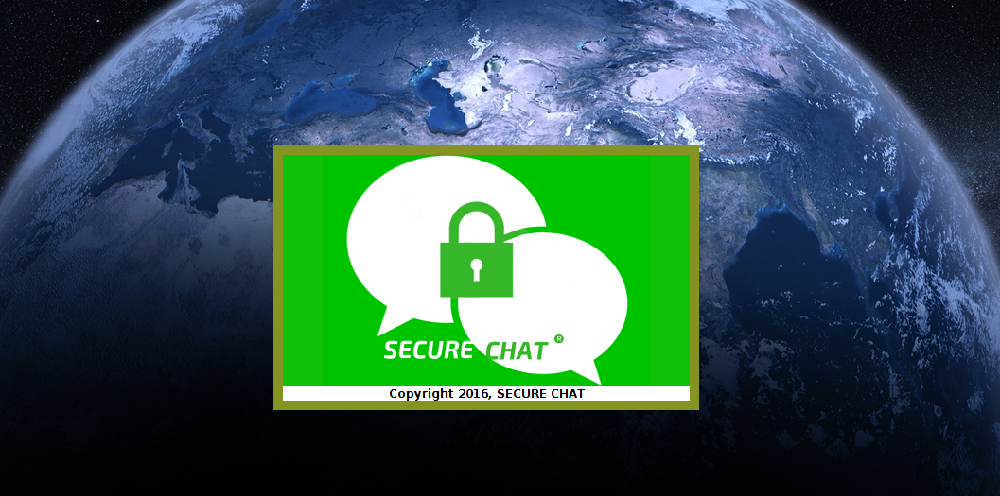
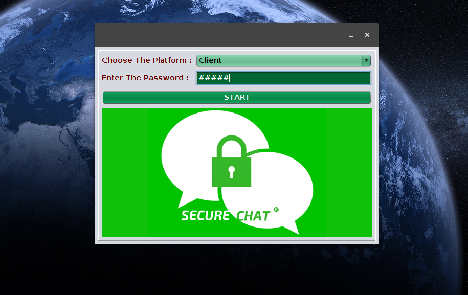

# Data Encryption System
In this project we use the cryptography techniques for encryption and decryption of message. While transmitting packet from source to destination, encrypt packet and transmit the packet at the receiving side decryption is done using a key that is only available to the user. When there is any data hacking at the middle of the network it is not possible to decrypt the packet.

##Loader

##Login

##Main Chat

